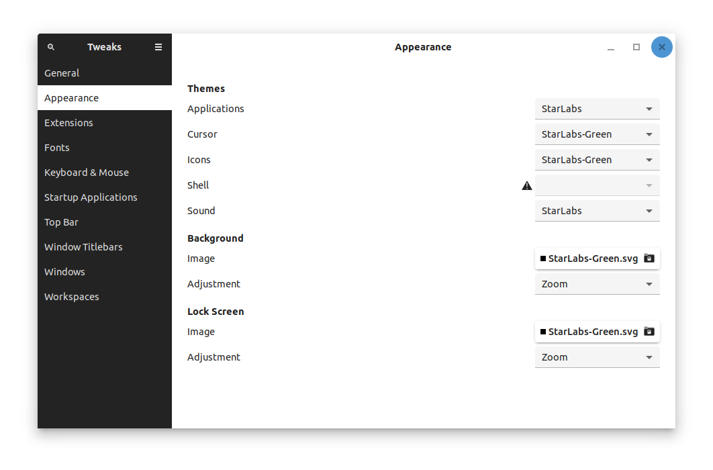

# Star Labs Theme 
Star Labs Theme

Includes:
* GTK 3.0 Theme
* GTK 2.0 Theme
* GNOME Shell Theme
* Plymouth Theme
* Sound Theme
* Icon Set
* Cursor Theme
* Grub Theme
* Desktop Wallpapers
* GNOME extensions
* Font


# How to install
## Ubuntu and Debian based distributions
##### Install
```
sudo add-apt-repository ppa:starlabs/ppa
sudo apt update
sudo apt install starlabstheme
```
##### Uninstall
```
sudo apt purge starlabstheme
```


## Other Distributions
##### Dependencies
You need to install:
```
git meson sassc inkscape x11-apps
```
##### Install, Update or Uninstall
```
git clone https://github.com/StarLabsLtd/StarLabsTheme.git
cd StarLabsTheme
./setup
```

## How to use

Once the theme is installed, reboot your machine.

At the login screen select your login username and then click the cog symbol.


From the dropdown menu, select 'StarLabs' from the session list.

Next, enter your password and proceed to login as normal.

## Using a different colour

StarLabsTheme now includes various colour schemes:
#### Orange

#### Green


If you installed StarLabsTheme from source using meson, you will have these variants. To install using the ppa, please use:
```
sudo apt install starlabstheme-green
sudo apt install starlabstheme-orange
```

It's also possible to mix and match various elements:
`sudo apt install starlabstheme-plymouth`
`sudo apt install starlabstheme-green-icons`


You can select different colours using the Gnome Tweak Tool:


Alternatively, from a terminal, using:
```
gsettings set org.gnome.desktop.interface icon-theme 'StarLabs-Green'
gsettings set org.gnome.desktop.interface cursor-theme 'StarLabs-Green'
gsettings set org.gnome.desktop.interface gtk-theme 'StarLabs-Green'
```

## Hacking
If you want a different color, it's fairly straight forward to add. There are two files that need editing:
`meson.build`
`meson_options.txt`

These files contain examples for adding a Red variant. 

#### meson_options.txt

```
option(
  'accents',
  type: 'array',
  choices: ['newColor'],
  description: 'Choose accent color(s)',
)

```

#### meson.build
```
foreach accent: get_option('accents')
  if accent == 'red'
    accent_suffix = ''
    scss_accent = '-Red'
    scss_hex = '#FF0000'
  endif
endforeach
```

## Copying or Reusing

This project has mixed licencing. You are free to copy, redistribute and/or modify aspects of this work under the terms of each licence accordingly (unless otherwise specified).

The StarLabs icon assets (any and all source `.svg` files or rendered `.png` files) are licensed under the terms of the [Creative Commons Attribution-ShareAlike 4.0 License](https://creativecommons.org/licenses/by-sa/4.0/).

Included scripts are free software licensed under the terms of the [GNU General Public License, version 3](https://www.gnu.org/licenses/gpl-3.0.txt).

Thanks to [Materia](https://github.com/nana-4/materia-theme) and all others that this theme was forked and inspired from.

# [© Star Labs® / All Rights Reserved.](https://starlabs.systems)
Any issues or questions, please contact us at [support@starlabs.systems](mailto:supportstarlabs.systems)

View our full range of Linux laptops at: [https://starlabs.systems](https://starlabs.systems)

