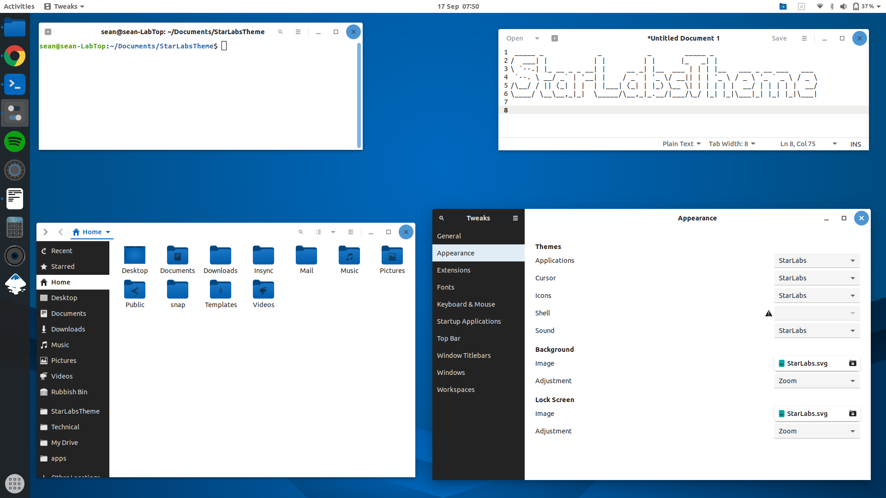
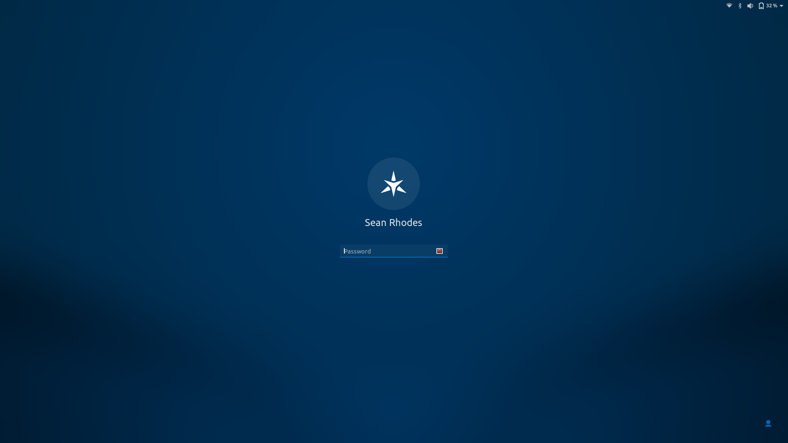

# Star Labs Theme 
Star Labs Theme

Includes:
* GTK 3.0 Theme
* GTK 2.0 Theme
* GNOME Shell Theme
* Plymouth Theme
* Sound Theme
* Icon Set
* Cursor Theme
* Grub Theme
* Desktop Wallpapers
* GNOME extensions
* Font






# Warning: This theme is currently in beta.
We still have a lot of work to do: more icons to add, bugs to squash and many tweaks. Please let us know what you think or if you find a bug!

We are all ears :)

# How to install
## Ubuntu and Debian based distributions
##### Install
```
sudo add-apt-repository ppa:starlabs/beta
sudo apt update
sudo apt install starlabstheme
```
##### Uninstall
```
sudo apt remove starlabstheme
```


## Other Distributions
##### Dependencies
You need to install:
```
git meson sassc
```
##### Install
```
git clone https://github.com/StarLabsLtd/StarLabsTheme.git
cd StarLabsTheme
meson build
ninja -C build
sudo ninja -C build install
```
##### Update
```
cd StarLabsTheme
git pull
ninja -C build reconfigure
sudo ninja -C build uninstall
sudo ninja -C build install
```

##### Uninstall
```
sudo ninja -C build uninstall
```

#### Additional Features
Some parts aren't configured on install. If you would like to use them, use the below commands. Make sure to undo these commands before uninstalling.

This isn't required if installed from our PPA.
### GDM3 Theme
##### Install
```
sudo update-alternatives --install /usr/share/gnome-shell/theme/gdm3.css gdm3.css /usr/share/gnome-shell/theme/StarLabs/gnome-shell.css 47
```
##### Uninstall
```
sudo update-alternatives --remove gdm3.css /usr/share/gnome-shell/theme/StarLabs/gnome-shell.css
```
### Session
##### Install
```
sudo glib-compile-schemas /usr/share/glib-2.0/schemas
```
##### Uninstall
```
sudo glib-compile-schemas /usr/share/glib-2.0/schemas 
```

### Plymouth
##### Install
```
sudo update-alternatives --install /usr/share/plymouth/themes/default.plymouth default.plymouth /usr/share/plymouth/themes/StarLabs/StarLabs.plymouth 150 --slave /usr/share/plymouth/themes/default.grub default.plymouth.grub /usr/share/plymouth/themes/StarLabs/StarLabs.grub
sudo update-initramfs -u
```
##### Uninstall
```
sudo update-alternatives --remove default.plymouth /usr/share/plymouth/themes/starlabs-logo/starlabs-logo.plymouth
sudo update-initramfs -u
```

## How to use

Once installed, reboot.

At the login screen select 'StarLabs' from the session list.


# [© Star Labs® / All Rights Reserved.](https://starlabs.systems)

Any issues or questions, please contact us at [support@starlabs.systems](mailto:supportstarlabs.systems)

View our range at: [https://starlabs.systems](https://starlabs.systems)

Star LabTop Mk III: Open Source Edition. This version of the Star LabTop Mk III will include the most popular requests:
+ Open-source Coreboot firmware
+ 16GB 2400MHz memory
+ English (US) keyboard
+ Improved speaker output

See the OSc Edition here: [https://www.kickstarter.com/projects/108557374](https://www.kickstarter.com/projects/108557374)


